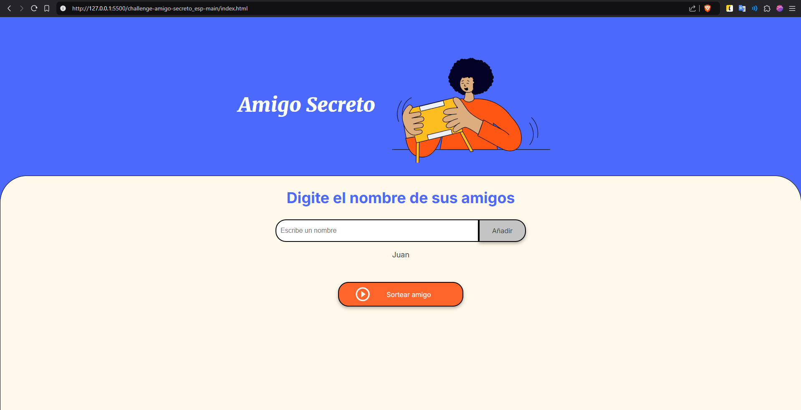
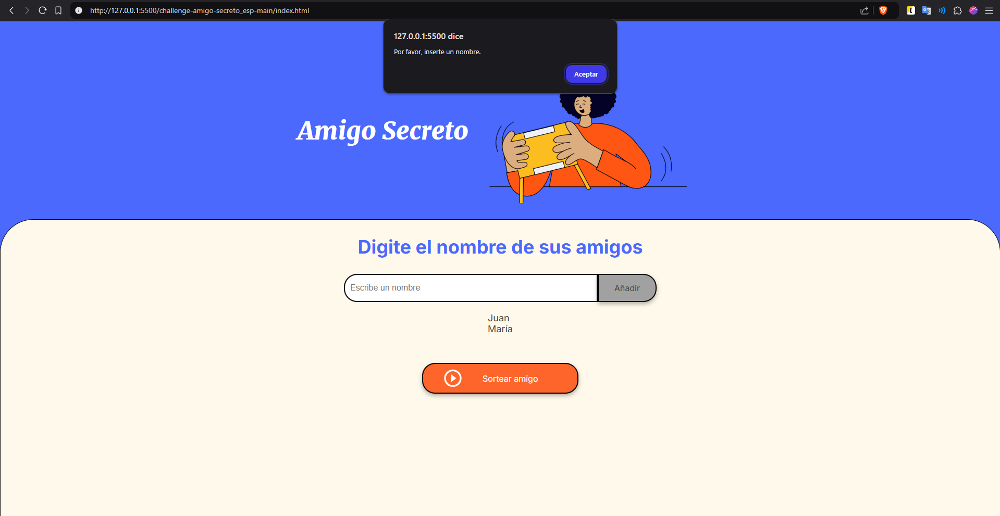
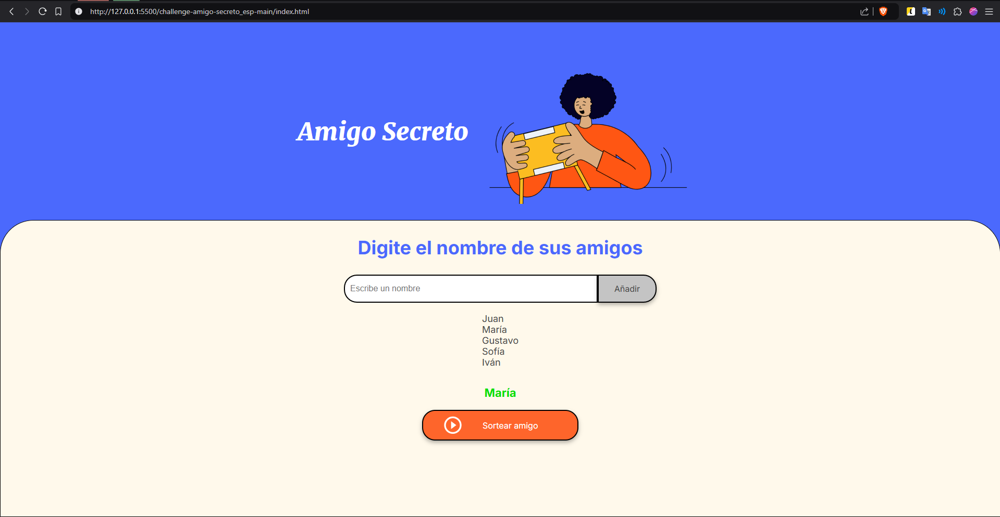

# Challenge Alura - Amigo Secreto

Recibe como entrada del usuario un nombre, cadena de texto no vacío, que se almacena en un arreglo, lo que a su vez borra el nombre del campo de texto.
Los nombres agregados aparecen en pantalla de manera dinámica.

Al sortear amigo se selecciona aleatoriamente un amigo entre todos los que existen en la lista almacenada como un arreglo.
El nombre del amigo sorteado aparece de manera dinámica en la pantalla.

## Funciones utilizadas

* **_agregarAmigo()_**

Función sin parámetros ni retorno, toma el nombre ingresado en el campo por el usuario, valida que no esté vacío, guarda en el array **_amigos_**, llama a la función **_leerAmigos()_** con el array **_amigos_** como argumento y borra el contenido del campo.

* **_leerAmigos(lista)_**

Función que recibe un array como parámetro, recorre todos sus elementos y agrega uno a uno como etiquetas de elementos de una lista.

* **_sortearAmigo()_**

Función sin parámetros ni retorno, genera un número aleatorio y lo redondea usando la biblioteca **_Math_**, el rango del número va desde el 0 hasta la longitud del array (No incluido). 

## Ejemplo de uso

* ### Agregando amigo a la lista

* ### Campo vacío

* ### Sorteo de un amigo

* ### Sorteo de otro amigo

